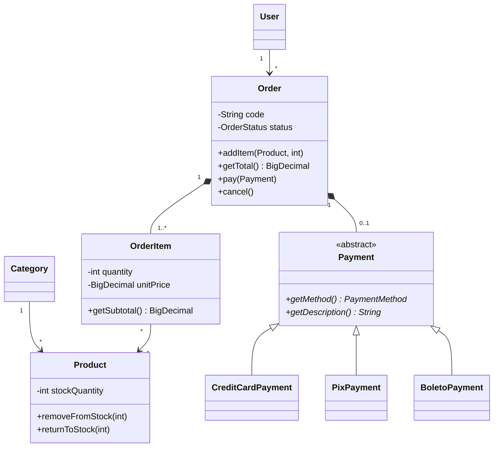
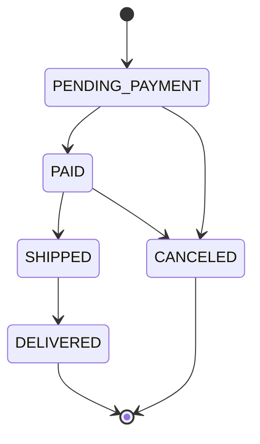

# E-commerce Orders API

API REST de catálogo e gestão de pedidos construída com **Java 21 + Spring Boot 4**.
Não é um CRUD: o foco está nas regras que um e-commerce de verdade precisa acertar —
reserva de estoque sob concorrência, preço congelado no momento da compra, máquina
de estados do pedido e autorização por dono do recurso.

[](https://github.com/pikachuzinn/ecommerce-api/actions/workflows/ci.yml)


---

## Sumário

- [O que este projeto demonstra](#o-que-este-projeto-demonstra)
- [Stack](#stack)
- [Como rodar](#como-rodar)
- [Endpoints](#endpoints)
- [Testando pelo terminal](#testando-pelo-terminal)
- [Arquitetura](#arquitetura)
- [Decisões de projeto](#decisões-de-projeto)
- [Testes](#testes)
- [Roadmap](#roadmap)

---

## O que este projeto demonstra

| Tema | Onde olhar |
|---|---|
| Modelagem orientada a objetos com agregado e invariantes | [`Order`](src/main/java/dev/henan/ecommerce/order/Order.java) |
| Herança e polimorfismo aplicados a um problema real | [`Payment`](src/main/java/dev/henan/ecommerce/order/payment/Payment.java) e suas 3 subclasses |
| Máquina de estados sem `if` espalhado | [`OrderStatus`](src/main/java/dev/henan/ecommerce/order/OrderStatus.java) |
| Concorrência: lock pessimista + `@Version` | [`OrderService.create`](src/main/java/dev/henan/ecommerce/order/OrderService.java) |
| Filtro dinâmico com Criteria API | [`ProductSpecifications`](src/main/java/dev/henan/ecommerce/catalog/ProductSpecifications.java) |
| Tratamento centralizado de erro com contrato estável | [`GlobalExceptionHandler`](src/main/java/dev/henan/ecommerce/common/exception/GlobalExceptionHandler.java) |
| Segurança stateless com JWT e autorização por papel e por dono | [`SecurityConfig`](src/main/java/dev/henan/ecommerce/config/SecurityConfig.java) |
| Schema versionado com Flyway, `ddl-auto: validate` | [`db/migration`](src/main/resources/db/migration) |
| Testes de integração contra PostgreSQL real (Testcontainers) | [`AbstractIntegrationTest`](src/test/java/dev/henan/ecommerce/api/AbstractIntegrationTest.java) |

📐 **[Diagramas UML completos](docs/modelagem.md)** — classes, máquina de estados,
sequência do checkout e modelo físico.

### Modelo de domínio (resumo)



### Ciclo de vida do pedido



---

## Stack

| Camada | Tecnologia |
|---|---|
| Linguagem | Java 21 (LTS) |
| Framework | Spring Boot 4.0 (Spring Framework 7) |
| Web | Spring MVC + virtual threads |
| Persistência | Spring Data JPA / Hibernate 7 |
| Banco | PostgreSQL 16 |
| Migrations | Flyway |
| Segurança | Spring Security 7 + OAuth2 Resource Server (JWT HS256) |
| Documentação | springdoc-openapi (Swagger UI) |
| Testes | JUnit 5, Mockito, AssertJ, MockMvc, Testcontainers |
| Build / Deploy | Maven, Docker multi-stage, GitHub Actions |

---

## Como rodar

### Opção 1 — Docker Compose (só precisa de Docker)

```bash
git clone https://github.com/pikachuzinn/ecommerce-api.git
cd ecommerce-api
docker compose up --build
```

A API sobe em `http://localhost:8080` com o banco já migrado e populado.

### Opção 2 — Maven local (banco no Docker)

```bash
docker compose up -d db
./mvnw spring-boot:run     # ou: mvn spring-boot:run
```

### Acessos

| Recurso | URL |
|---|---|
| Swagger UI | http://localhost:8080/swagger-ui.html |
| OpenAPI JSON | http://localhost:8080/v3/api-docs |
| Health | http://localhost:8080/actuator/health |

### Contas de exemplo

Criadas pela migration `V2__seed_catalog.sql`. **São de desenvolvimento — troque antes de expor qualquer ambiente.**

| E-mail | Senha | Papéis |
|---|---|---|
| `admin@ecommerce.dev` | `Admin@123` | `ROLE_ADMIN`, `ROLE_CUSTOMER` |
| `cliente@ecommerce.dev` | `Admin@123` | `ROLE_CUSTOMER` |

---

## Endpoints

`ROLE_ADMIN` é exigido onde indicado; `🔒` marca endpoints que exigem token.

### Autenticação

| Método | Rota | Descrição |
|---|---|---|
| `POST` | `/api/v1/auth/register` | Cria conta de cliente |
| `POST` | `/api/v1/auth/login` | Devolve o access token JWT |

### Catálogo

| Método | Rota | Acesso |
|---|---|---|
| `GET` | `/api/v1/products` | público — filtros `name`, `categoryId`, `minPrice`, `maxPrice`, `activeOnly` + paginação |
| `GET` | `/api/v1/products/{id}` | público |
| `POST` | `/api/v1/products` | 🔒 ADMIN |
| `PUT` | `/api/v1/products/{id}` | 🔒 ADMIN |
| `DELETE` | `/api/v1/products/{id}` | 🔒 ADMIN — desativa, não apaga |
| `GET` | `/api/v1/categories` | público |
| `POST` `PUT` `DELETE` | `/api/v1/categories[/{id}]` | 🔒 ADMIN |

### Pedidos

| Método | Rota | Acesso |
|---|---|---|
| `POST` | `/api/v1/orders` | 🔒 cliente — fecha o pedido e reserva estoque |
| `GET` | `/api/v1/orders/me` | 🔒 cliente — os próprios pedidos |
| `GET` | `/api/v1/orders/{id}` | 🔒 dono do pedido ou ADMIN |
| `GET` | `/api/v1/orders?status=` | 🔒 ADMIN |
| `POST` | `/api/v1/orders/{id}/payment` | 🔒 dono ou ADMIN |
| `POST` | `/api/v1/orders/{id}/cancellation` | 🔒 dono ou ADMIN |
| `POST` | `/api/v1/orders/{id}/shipment` | 🔒 ADMIN |
| `POST` | `/api/v1/orders/{id}/delivery` | 🔒 ADMIN |

### Contrato de erro

Toda falha devolve o mesmo formato, sem stack trace:

```json
{
  "timestamp": "2026-09-03T14:22:31.104Z",
  "status": 422,
  "error": "Unprocessable Entity",
  "message": "Estoque insuficiente para o produto GAM-003: disponivel 5, solicitado 999.",
  "path": "/api/v1/orders",
  "fields": []
}
```

| Situação | HTTP |
|---|---|
| Campo inválido (Bean Validation) | `400` + lista em `fields` |
| Token ausente ou inválido | `401` |
| Autenticado mas sem permissão | `403` |
| Recurso inexistente | `404` |
| Violação de integridade | `409` |
| Regra de negócio violada | `422` |

---

## Testando pelo terminal

```bash
# 1. Autenticar
TOKEN=$(curl -s -X POST http://localhost:8080/api/v1/auth/login \
  -H 'Content-Type: application/json' \
  -d '{"email":"cliente@ecommerce.dev","password":"Admin@123"}' \
  | sed -E 's/.*"accessToken":"([^"]+)".*/\1/')

# 2. Ver o catálogo (público)
curl -s 'http://localhost:8080/api/v1/products?name=mouse&size=5'

# 3. Fechar um pedido
curl -s -X POST http://localhost:8080/api/v1/orders \
  -H "Authorization: Bearer $TOKEN" \
  -H 'Content-Type: application/json' \
  -d '{
    "items": [{"productId": 5, "quantity": 2}],
    "shippingAddress": {
      "street": "Rua das Flores", "number": "100", "district": "Centro",
      "city": "Londrina", "state": "PR", "zipCode": "86010-000"
    },
    "shippingFee": 25.00
  }'

# 4. Pagar com Pix
curl -s -X POST http://localhost:8080/api/v1/orders/1/payment \
  -H "Authorization: Bearer $TOKEN" \
  -H 'Content-Type: application/json' \
  -d '{"method":"PIX","pixTxid":"txid-demo-001"}'
```

---

## Arquitetura

Pacotes organizados **por domínio**, não por camada técnica. Tudo que fala de pedido
mora junto; assim uma mudança de regra toca um pacote, não seis.

```
dev.henan.ecommerce
├── config/            SecurityConfig, JwtConfig, OpenApiConfig
├── common/
│   ├── dto/           PageResponse — envelope de paginação próprio
│   └── exception/     BusinessException, ResourceNotFoundException, GlobalExceptionHandler
├── auth/              User, Role, TokenService, AuthService, AuthController
├── catalog/           Category, Product, Specifications, Services, Controllers
└── order/
    ├── payment/       Payment (abstrata), CreditCard, Pix, Boleto
    ├── Order          raiz do agregado — concentra as invariantes
    ├── OrderStatus    máquina de estados
    └── OrderService   orquestra transação, estoque e autorização
```

Fluxo de uma requisição:

```
Controller  →  valida DTO, resolve o usuário do token, devolve HTTP
    ↓
Service     →  abre a transação, orquestra repositórios, aplica autorização
    ↓
Domínio     →  Order / Product decidem o que é válido (as regras vivem aqui)
    ↓
Repository  →  Spring Data JPA
```

**A regra de negócio mora na entidade, não no service.** `OrderService` não sabe
quais transições de status são válidas — ele chama `order.ship()` e a entidade
recusa se não puder. Isso é o que torna `OrderTest` e `OrderStatusTest` possíveis
sem subir nenhum contexto Spring.

---

## Decisões de projeto

<details>
<summary><b>Por que lock pessimista na baixa de estoque?</b></summary>

Dois pedidos simultâneos do último item leem `stock = 1`, ambos passam na validação
e o estoque vai a `-1`. `findByIdForUpdate` faz `SELECT ... FOR UPDATE`, serializando
as duas transações naquela linha. O `@Version` em `Product` cobre o caminho de
atualização pelo painel administrativo, onde o conflito é raro e falhar rápido é
mais barato que travar a linha.
</details>

<details>
<summary><b>Por que o preço é copiado para o item do pedido?</b></summary>

Se o `OrderItem` só apontasse para o `Product`, um reajuste no catálogo mudaria
retroativamente o valor de pedidos já fechados — e a nota fiscal deixaria de bater.
`unitPrice`, `productName` e `productSku` são snapshots do momento da compra.
</details>

<details>
<summary><b>Por que herança em `Payment` e não um enum com campos opcionais?</b></summary>

Cada meio de pagamento tem dados e validações próprios: parcelamento de 1 a 12x só
faz sentido no cartão; vencimento futuro só no boleto. Com herança, cada regra fica
na classe que a possui e `getDescription()` resolve por polimorfismo em vez de um
`switch` que cresce a cada meio novo. `SINGLE_TABLE` mantém a consulta polimórfica
sem `join`.
</details>

<details>
<summary><b>Por que `PageResponse` em vez de devolver o `Page` do Spring?</b></summary>

O JSON do `Page` não é um contrato estável entre versões do Spring Data (e o próprio
Spring emite aviso sobre isso). Um envelope próprio garante que atualizar o framework
não quebre o cliente da API.
</details>

<details>
<summary><b>Por que `ddl-auto: validate` e não `update`?</b></summary>

`update` deixa o Hibernate alterar o schema em silêncio, nunca remove nada e não é
reproduzível entre ambientes. Aqui o Flyway é o dono do schema e o Hibernate apenas
confere no boot: se a entidade e a migration divergirem, a aplicação não sobe —
o erro aparece no CI, não em produção.
</details>

<details>
<summary><b>Por que JWT simétrico (HS256)?</b></summary>

Quem emite e quem valida o token são o mesmo serviço, então HMAC resolve com uma
dependência a menos. Se um segundo serviço precisar validar sem poder emitir, a
troca correta é RSA/EC — chave pública para validar, privada para assinar. A
mudança fica isolada em `JwtConfig`.
</details>

<details>
<summary><b>Por que <code>open-in-view: false</code>?</b></summary>

O padrão do Spring Boot mantém a sessão JPA aberta durante a serialização da
resposta, o que esconde problemas de N+1 e segura conexão do pool por mais tempo.
Desligado, qualquer acesso lazy fora da transação estoura na hora — por isso os
`@EntityGraph` no `OrderRepository` são explícitos.
</details>

---

## Testes

```bash
mvn test              # unitários (rápidos, sem Docker)
mvn verify            # unitários + integração (precisa de Docker rodando)
```

| Camada | Ferramenta | O que cobre |
|---|---|---|
| Domínio | JUnit 5 + AssertJ | invariantes de `Order`, `Product` e a matriz completa de transições de `OrderStatus` |
| Serviço | Mockito | consolidação de itens, baixa e devolução de estoque, autorização por dono |
| API | MockMvc + Testcontainers | fluxo ponta a ponta contra PostgreSQL real, com as migrations do Flyway |

Os testes de integração sobem um PostgreSQL 16 efêmero via Testcontainers e rodam
as mesmas migrations de produção — é o único jeito de validar migrations, constraints
e o SQL que o Hibernate realmente gera. Cada caso roda em transação com rollback,
então a ordem de execução não importa.

---

## Roadmap

- [ ] **Fase 2 — agente de IA sobre esta API:** classificação automática de pedidos
      em risco, atendimento por linguagem natural e webhooks para orquestração (n8n).
- [ ] Cupons de desconto e regras de frete por região
- [ ] Cache de catálogo com Redis
- [ ] Eventos de domínio (`OrderPaid`, `OrderShipped`) para notificação assíncrona
- [ ] Observabilidade: métricas de negócio no Actuator + traces com OpenTelemetry

---

## Licença

[MIT](LICENSE) © Henan Heiiji Shirahige
