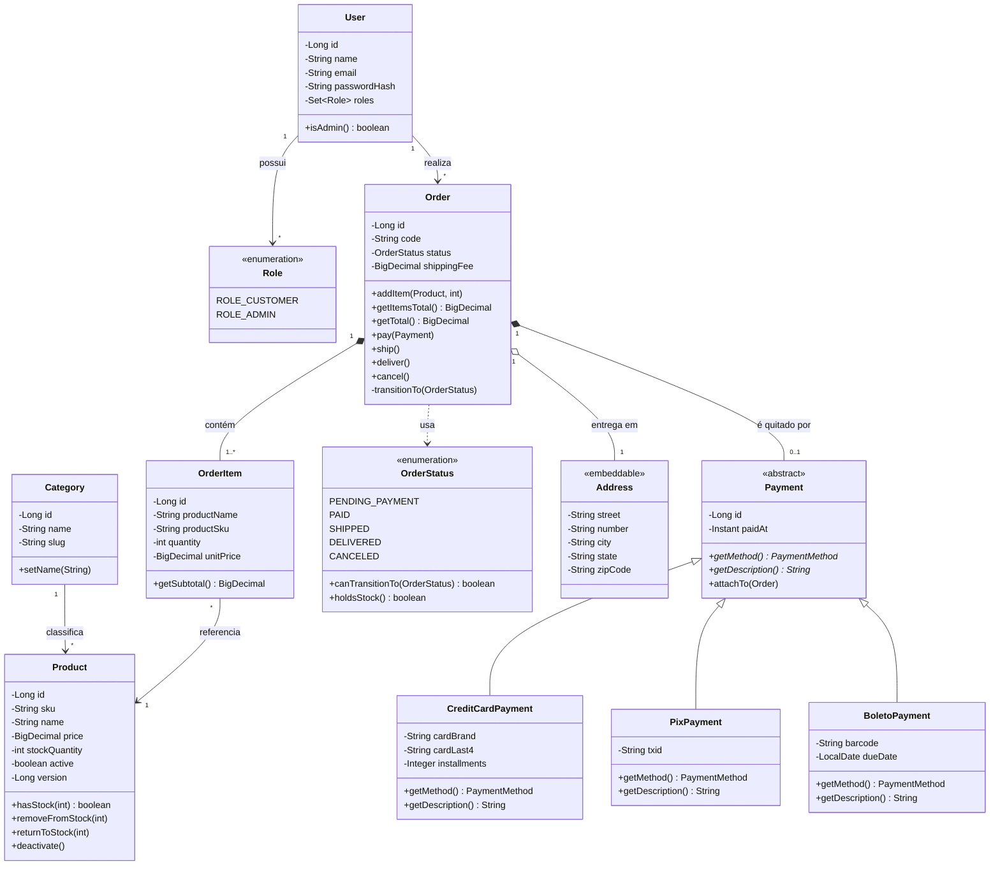
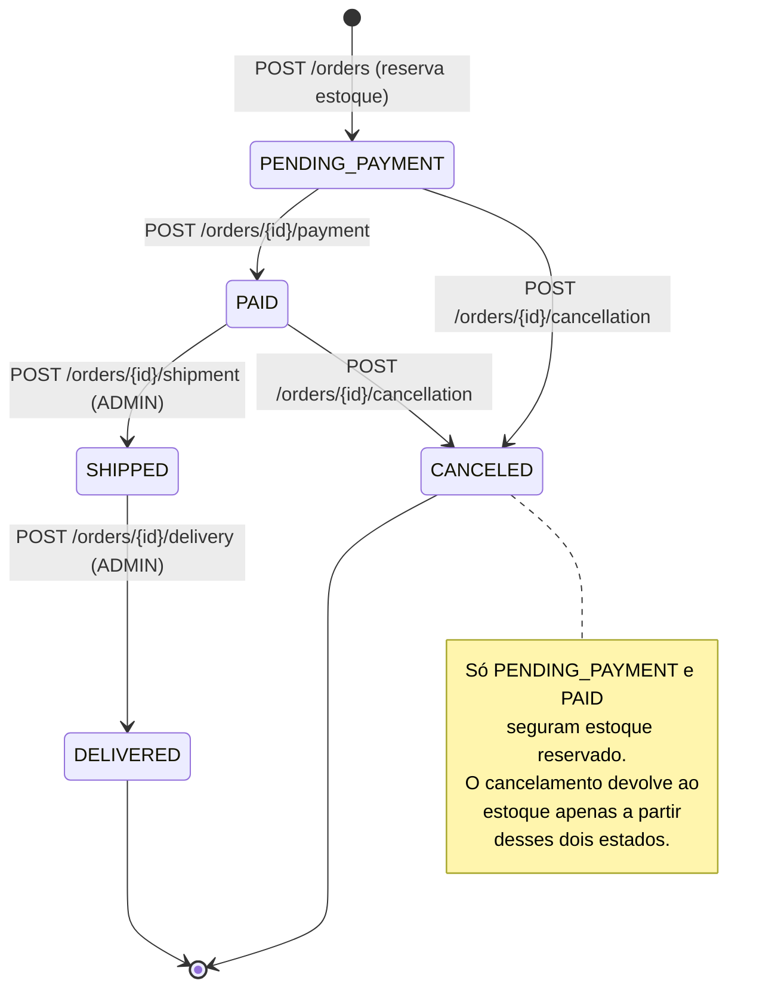
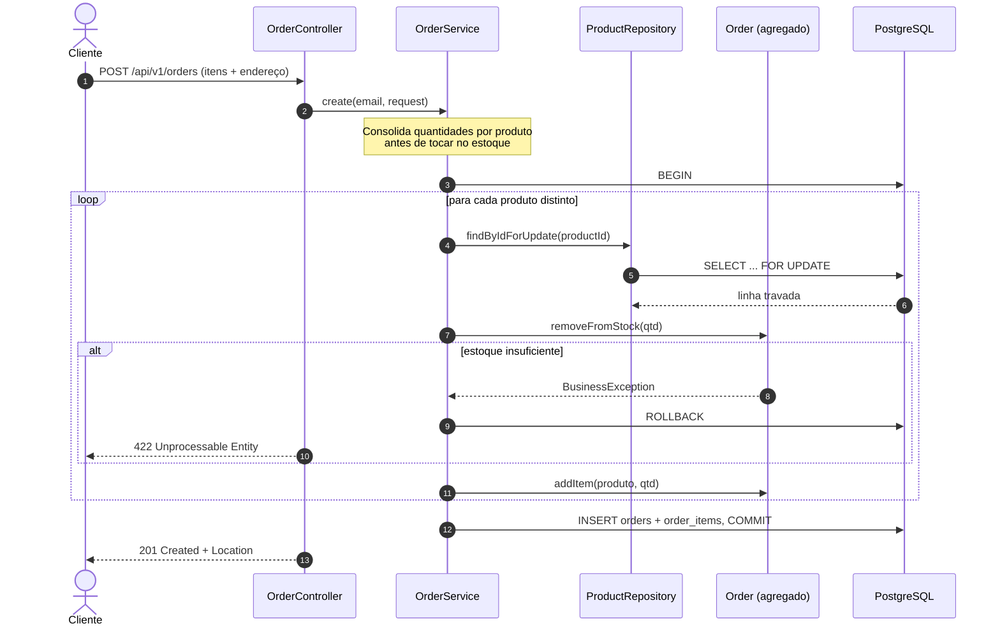
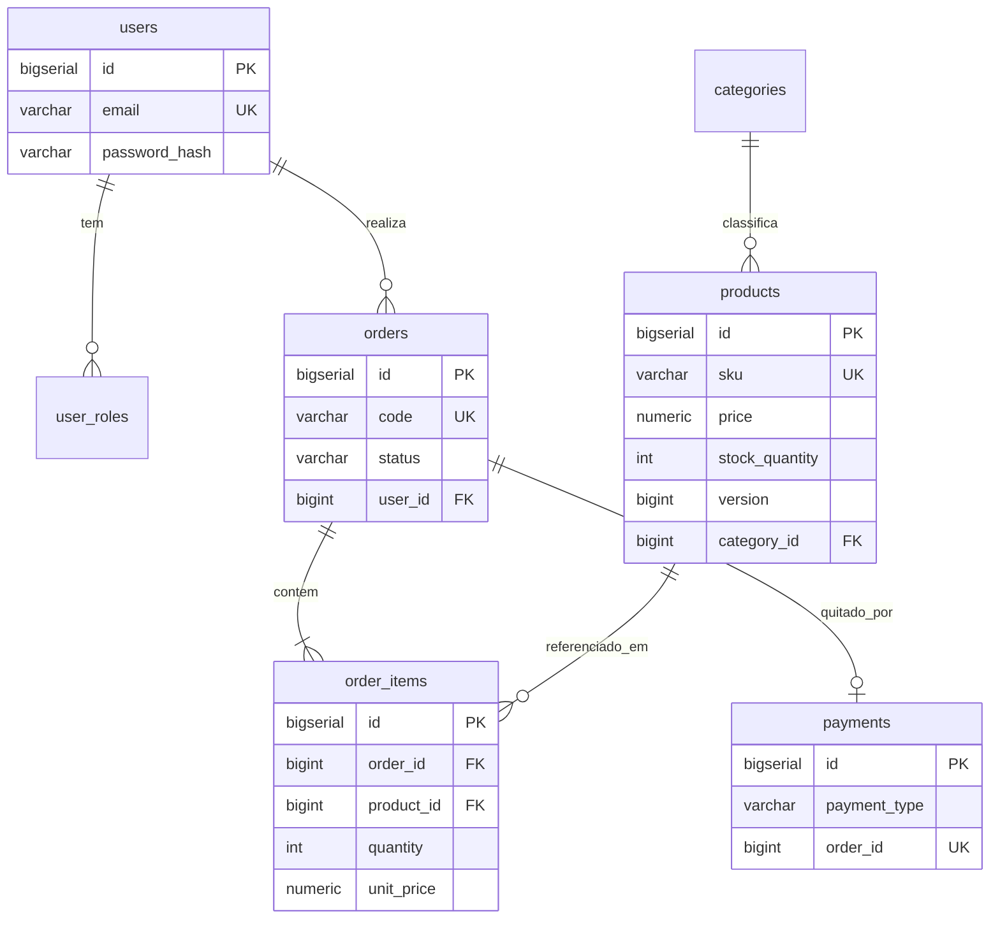

# Modelagem

## Diagrama de classes de domínio

`Order` é a raiz do agregado: `OrderItem` e `Payment` só nascem e morrem através dela.
Nenhuma camada externa consegue instanciar um `OrderItem` solto — o construtor é
package-private de propósito.

## Máquina de estados do pedido

O grafo de transições vive dentro do enum `OrderStatus`, não espalhado em `if`s
pelo service. Adicionar um estado novo (`REFUNDED`, por exemplo) é mexer em um
arquivo só, e os testes parametrizados de `OrderStatusTest` cobrem a matriz inteira.

## Sequência do fechamento de pedido

O `SELECT ... FOR UPDATE` serializa duas compras simultâneas do mesmo produto.
Sem ele, dois pedidos concorrentes leem `stock = 1` e ambos passam na validação —
o clássico problema de _lost update_ que só aparece em produção, nunca no teste manual.

## Modelo físico

**Herança `payments`:** estratégia `SINGLE_TABLE` discriminada por `payment_type`.
Troca espaço (colunas nulas para os tipos que não as usam) por consultas polimórficas
sem `join`, que é o padrão de acesso deste domínio. `JOINED` faria sentido se os
meios de pagamento tivessem muitos campos próprios ou se houvesse dezenas deles.
